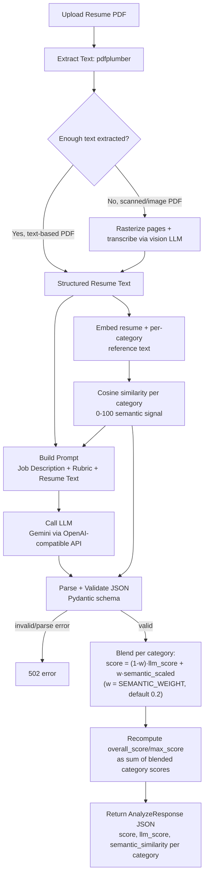
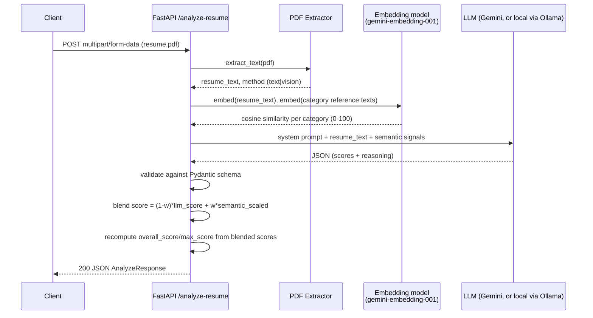

# resume-analyser

Analyzes a PDF resume against the **AI & Data Solution Intern** role and returns a
scored JSON assessment (education, experience, skills, tools, knowledge). Uses a
hybrid pipeline: an embedding model computes an independent semantic-similarity
signal per category, which is fed into an LLM that does the evidence-grounded
scoring and reasoning — similar in spirit to how "person-job fit" research combines
embedding similarity with a learned/LLM-based judge rather than relying on either
signal alone.

The LLM/embedding provider is fully swappable via env vars, since both are called
through the OpenAI-compatible API shape. Defaults to **Gemini's free tier**
(`gemini-3.6-flash` + `gemini-embedding-001`, cloud-hosted, fast) — a local
open-source model via Ollama (e.g. `qwen3:8b`) is also supported, see
"Alternative: local LLM (Ollama)" below.

## Flow



API request flow:



If the embedding backend is unavailable (e.g. bad API key, or a local `nomic-embed-text`
not pulled), the API logs a warning and falls back to LLM-only scoring —
`semantic_similarity` and `llm_score` are `null`/equal to `score` in the response. It's
a supporting signal, never a hard dependency.

Vision-LLM transcription (the scanned-PDF fallback) transcribes each page independently. A page
whose transcription call fails (rate limit, transient error) is retried once after a short delay;
if it fails again, the rest of the pages are still processed — the failed page is marked
`[page N: transcription failed]` in the extracted text rather than failing the whole request.
That marker is visible in the UI's raw-text viewer, so a reviewer can catch it.

## How scoring works

Per category:

1. The LLM reads the resume + job description + rubric and returns an evidence-grounded
   `llm_score` (0..category max), never trusting the embedding signal alone for this.
2. The embedding signal is rescaled to the category's point range:
   `semantic_scaled = semantic_similarity/100 * category_max`.
3. The two are blended: `score = round((1 - w) * llm_score + w * semantic_scaled)`,
   `w = SEMANTIC_WEIGHT` (default `0.2`), clamped to `[0, category_max]`.

`overall_score` and `max_score` are **recomputed in code** as the sum of the blended
category scores / category maxes — the API does not trust the LLM's own arithmetic,
only its per-category judgment. All of `score`, `llm_score`, and `semantic_similarity`
are returned per category so you can see the raw LLM score, the embedding signal, and
the final blended score side by side.

## Human review UI

A lightweight Streamlit app (`streamlit_app.py`) sits in front of the API for human-in-the-loop
review: upload a resume, see the LLM score / embedding signal / blended score per category side
by side, optionally override each category's score, and submit a decision (approve / needs
changes / reject) with notes. Every submitted review is appended as one JSON line to
`data/feedback_log.jsonl` — useful later for calibrating `SEMANTIC_WEIGHT` or spot-checking the
LLM's judgment against a human's. It talks to the API purely over HTTP (`API_BASE_URL`), so it
can run against any running instance of the API, local or Dockerized.

A collapsible "View raw extracted text" section shows exactly what the LLM saw — the text
`pdfplumber` (or vision-LLM transcription) pulled out of the PDF, not a summary of it. It's
expanded automatically and flagged with a warning when `extraction_method` is `"vision"`, since
transcription from a scanned page image is inherently more error-prone than direct text
extraction, and a reviewer should sanity-check it against the saved PDF before trusting the
scores below it.

## Project structure

```
app/
├── main.py                  # FastAPI app: POST /analyze-resume, GET /resumes/{id}, GET /health
├── config.py                # env-driven settings (LLM endpoint, thresholds)
├── schemas.py                # Pydantic response schema
├── extractors/
│   └── pdf_extractor.py     # pdfplumber, falls back to vision-LLM transcription for scanned PDFs
└── llm/
    ├── prompt.py             # job description, rubric, system prompt
    ├── embeddings.py         # embedding-based semantic-similarity signal per category
    └── analyzer.py           # calls the LLM, parses/validates JSON output
streamlit_app.py              # human review UI (see "Human review UI" above)
scripts/
└── pick_sample_resumes.py      # randomly picks real resume PDFs into data/picked/
data/                            # gitignored: uploaded resumes, downloaded dataset, picked fixtures, feedback log
```

## Setup (Docker, recommended)

1. Get a free Gemini API key at [aistudio.google.com/apikey](https://aistudio.google.com/apikey)
   (no billing required for the free tier).

2. Copy `.env.example` to `.env` and paste your key in as `LLM_API_KEY`:

   ```bash
   cp .env.example .env
   # edit .env: set LLM_API_KEY=<your key>
   ```

3. Build and start the API + review UI:

   ```bash
   docker compose up -d --build
   ```

- API: `http://localhost:8000/docs`
- Review UI: `http://localhost:8501`

Logs: `docker compose logs -f app` (or `ui`). Stop with `docker compose down`.

### Alternative: local LLM (Ollama)

To run fully locally/offline instead of Gemini (see the trade-offs discussed in
"Troubleshooting" below — local CPU inference is much slower):

1. In `.env`, uncomment the "Alternative: local LLM" block at the bottom (sets
   `LLM_BASE_URL`/`LLM_MODEL`/`LLM_API_KEY`/`LLM_TIMEOUT`/`EMBEDDING_MODEL` for Ollama)
   and comment out the Gemini values above it.
2. Start everything, including the `ollama` service (off by default):

   ```bash
   docker compose --profile local-llm up -d --build
   docker compose exec ollama ollama pull qwen3:8b
   docker compose exec ollama ollama pull nomic-embed-text
   ```

## Setup (local, without Docker)

1. Create a virtualenv and install dependencies:

   ```bash
   python -m venv .venv && source .venv/bin/activate
   pip install -r requirements.txt
   ```

   `pdf2image` (used only for the scanned-PDF fallback) needs the `poppler` system
   binary — `brew install poppler` on macOS, `apt install poppler-utils` on Linux.
   Most resumes are text-based PDFs handled by `pdfplumber` alone, so this rarely
   matters in practice.

2. Copy `.env.example` to `.env` and set `LLM_API_KEY` to a free Gemini key from
   [aistudio.google.com/apikey](https://aistudio.google.com/apikey):

   ```bash
   cp .env.example .env
   ```

   To use a local model instead, uncomment the "Alternative: local LLM" block in
   `.env` and run [Ollama](https://ollama.com) yourself:

   ```bash
   ollama pull qwen3:8b
   ollama pull nomic-embed-text
   ollama serve   # exposes http://localhost:11434/v1
   ```

   Any other OpenAI-compatible server (vLLM, LM Studio, etc.) works too — just
   point `LLM_BASE_URL` / `LLM_MODEL` at it.

3. Start the API:

   ```bash
   uvicorn app.main:app --reload
   ```

4. (Optional) Start the review UI, in a separate terminal:

   ```bash
   pip install -r requirements-ui.txt
   streamlit run streamlit_app.py
   ```

   Opens at `http://localhost:8501`, talking to the API at `http://localhost:8000`
   by default (override with `API_BASE_URL`).

## Testing

Locally:

```bash
pip install -r requirements.txt -r requirements-dev.txt
pytest
```

Or via Docker, no local Python setup needed:

```bash
docker compose --profile test run --rm test
```

33 tests covering PDF extraction (both the pdfplumber path and the vision-LLM fallback, with
mocked LLM calls), score blending/recompute, the API endpoints (upload validation, `resume_id`
persistence, path-traversal rejection, auth on/off), and the embedding similarity math. No network
calls or real LLM credentials needed — everything that talks to an LLM is mocked, and the Docker
test image doesn't even read `.env`.

## Usage

```bash
curl -X POST http://localhost:8000/analyze-resume \
  -H "Authorization: Bearer $API_AUTH_TOKEN" \
  -F "file=@/path/to/resume.pdf"
```

`Authorization` is only required if `API_AUTH_TOKEN` is set in `.env` — see "Auth" below.

Each upload is saved as `data/uploads/<resume_id>.pdf` — the response's `resume_id` is the
filename (no original filename or extra metadata is used, avoiding any path-traversal surface).
Fetch it back with:

```bash
curl http://localhost:8000/resumes/<resume_id> -H "Authorization: Bearer $API_AUTH_TOKEN" -o resume.pdf
```

There's no database — the filesystem *is* the store, and `data/` is gitignored, so nothing here
is ever committed.

### Auth

`POST /analyze-resume` and `GET /resumes/{id}` require a bearer token — `Authorization: Bearer
<API_AUTH_TOKEN>` — whenever `API_AUTH_TOKEN` is set in `.env`. Leave it empty (the `.env.example`
default) to disable auth entirely, which is fine for local-only use. Generate one with
`openssl rand -hex 32`; the Streamlit UI reads the same env var and sends it automatically, so
there's nothing extra to configure there. `GET /health` is always open (for infra health checks).

### Test resumes

There's no `samples/` folder committed to the repo — instead, `scripts/pick_sample_resumes.py`
pulls real resume PDFs on demand from the
[Kaggle "Resume Dataset"](https://www.kaggle.com/datasets/snehaanbhawal/resume-dataset)
(2,485 anonymized resumes across 24 job categories, PDF + text). Kaggle requires a login to
download, so that part isn't scripted:

```bash
# 1. https://www.kaggle.com/datasets/snehaanbhawal/resume-dataset -> Download (needs a free account)
# 2. Save the zip to data/raw/kaggle_resume_dataset/archive.zip

python scripts/pick_sample_resumes.py --strong 1 --medium 1 --weak 1 --seed 42
```

The picker randomly samples resumes from three category pools (`strong`:
INFORMATION-TECHNOLOGY/ENGINEERING — the closest fit the dataset has to a data/AI role,
`medium`: CONSULTANT/BUSINESS-DEVELOPMENT/FINANCE/BANKING/DIGITAL-MEDIA, `weak`: SALES/TEACHER
and other unrelated categories — see `POOLS` in the script) and copies the real PDFs, unmodified,
into `data/picked/`. Pass `--seed` for reproducible picks, or omit it for a fresh random draw.
Everything under `data/` is gitignored — nothing here is ever committed.

```bash
curl -X POST http://localhost:8000/analyze-resume -F "file=@data/picked/strong_information-technology_19201175.pdf"
```

**Privacy note:** these are real people's resumes (Kaggle's dataset card describes them as
anonymized, and spot-checking a few shows template-style content — one even had a literal
`[Job Title]` placeholder left in). No further scrubbing is applied. Treat `data/` as sensitive:
don't commit it, don't redistribute anything pulled from it, and review before using it beyond
local testing.

## Troubleshooting

**Can't open `http://app:8000` in a browser.** `app` is a Docker Compose service name — it only
resolves inside the compose network (e.g. from the `ui` container). From your host machine's
browser, use `http://localhost:8000/docs` (API) and `http://localhost:8501` (review UI), both
plain `http`, not `https`.

**502 "LLM call failed ... 404 ... This model ... is no longer available".** Google
retires/renames free-tier Gemini models periodically (this happened once already during
development: `gemini-2.5-flash` → `gemini-3.6-flash`). The error message itself names the
replacement model to use — put it in `LLM_MODEL` in `.env`, or check
[ai.google.dev/gemini-api/docs/models](https://ai.google.dev/gemini-api/docs/models) for the
current lineup.

**"Analysis failed: ... Read timed out" / 502 "LLM call failed ... Request timed out" / a
slow-to-hang `/analyze-resume` call, when using the default Gemini setup.** Almost always a
missing/invalid `LLM_API_KEY` or a hit rate limit (Gemini's free tier is 10 requests/min, 1500/day
for `gemini-3.6-flash` as of writing) — check `docker compose logs -f app` for the actual error
message from Gemini (the 502's `detail` field also includes it). This shouldn't be a genuine
timeout on the default setup; Gemini normally responds in a few seconds.

**Same symptoms, but using the local LLM alternative (Ollama).** Ollama running inside Docker
Desktop on macOS cannot access Apple Silicon's Metal GPU (Docker's Linux VM has no GPU
passthrough), so it falls back to pure CPU inference — in testing this measured **~1.5
tokens/sec** for qwen3:8b (`docker compose logs ollama` will show `tg = ...t/s` lines confirming
your own rate). A full resume-analysis prompt plus a thinking-mode Qwen3 response can genuinely
take several minutes end to end — that's why the local-LLM `.env` block sets `LLM_TIMEOUT=1200`s
and `API_REQUEST_TIMEOUT` should be raised to match (~2500s) if you hit timeouts there. If so:

- Raise `LLM_TIMEOUT` / `API_REQUEST_TIMEOUT` further — there's nothing wrong with the pipeline,
  it's genuinely compute-bound on CPU-only inference.
- Confirm `LLM_MAX_RETRIES=0` (the default). The OpenAI SDK retries failed/timed-out calls twice
  by default, which would silently multiply the wait instead of failing predictably.
- `docker compose exec ollama ollama list` — confirm both `qwen3:8b` and `nomic-embed-text` show
  up (an incomplete pull looks like a hang, not a clear error).
- `time docker compose exec ollama ollama run qwen3:8b "hi"` — measure your own tokens/sec
  directly against Ollama, bypassing this app entirely, to isolate whether it's an Ollama/hardware
  issue vs. something in the app.
- For meaningfully faster local inference, run Ollama natively on macOS (`brew install ollama`,
  outside Docker) so it can use Metal GPU acceleration, and point `LLM_BASE_URL` at
  `http://host.docker.internal:11434/v1` instead of the `ollama` service. Still generally slower
  and less predictable than just using the default Gemini setup, though.

## Output schema

```json
{
  "resume_id": "205fdbba-f4f1-4494-86df-17c1b24f415f",
  "filename": "resume.pdf",
  "extraction_method": "text",
  "extracted_text": "Jane Doe\nEducation\nB.Sc. in Computer Science...",
  "result": {
    "job_title": "AI & Data Solution Intern",
    "overall_score": 78,
    "max_score": 100,
    "breakdown": {
      "education": {"score": 18, "max": 20, "reasoning": "...", "llm_score": 18, "semantic_similarity": 81.4},
      "experience": {"score": 15, "max": 25, "reasoning": "...", "llm_score": 15, "semantic_similarity": 62.1},
      "skills": {"score": 22, "max": 25, "reasoning": "...", "llm_score": 22, "semantic_similarity": 88.7},
      "tools_and_technologies": {"score": 13, "max": 15, "reasoning": "...", "llm_score": 13, "semantic_similarity": 74.0},
      "knowledge_and_domain": {"score": 10, "max": 15, "reasoning": "...", "llm_score": 10, "semantic_similarity": 58.9}
    },
    "strengths": ["...", "..."],
    "gaps": ["...", "..."],
    "recommendation": "...",
    "raw_resume_summary": "..."
  }
}
```
